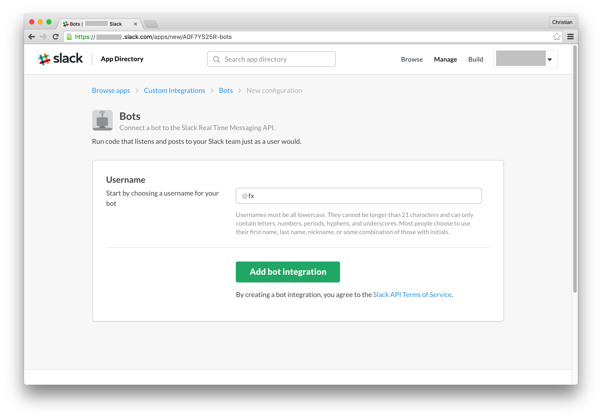
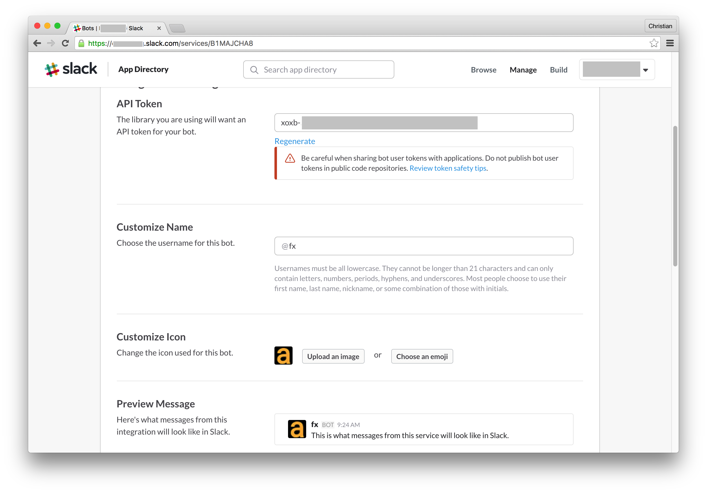
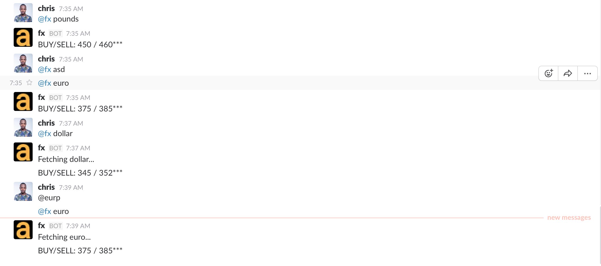

## AbokiFx Slackbot 

Slack integration for AbokiFx. If you are always busy with your team on Slack and need a to quickly ask [AbokiFx](http://abokifx.com) black market dollar rate, then you might need to invite this bot to Slack.

### Playground
**1) Create a new Bot on Slack**

Go to `https://[yourorganization].slack.com/services/new/bot` and create a new bot:



**2) Customize and Store API Toke**

You can add a custom image for the bot as seen or just use and emoji if the drama is too much. You should also store your token somewhere safe



**3) Clone and Run**

Clone the following repo:

```bash
git clone https://github.com/christiannwamba/abokifx-bot

cd abokifx-bot

npm install
```

Run the bot:

```bash
# Mac or Linux
BOT_API_KEY=your_api_key node index.js
# Windows
set BOT_API_KEY=your_api_key & node index.js
```

Go to the Slack team you integrated the bot and ask her Fx questions:

1. @fx dollar : get's dollar rate

2. @fx pounds : get's pounds rate

3. @fx euro : get's euro rate

> She will only answer you if you ask her in a private conversation or invite her to a team before asking her the above questions



### Production
You can as well deploy the bot to Heroku because the free version will just do for her task and Heroku is easy

**1) Install Heroku Toolbelt**

You will need the [Heroku Toolbet](Heroku toolbelt) to run Heroku command. Download and install it.

After installation, run:

```bash
heroku login
```

You will be prompted to provide your Heroku credentials, do so.

**2) Create and Deploy**

Now create a Heroku app by running:

```bash
heroku create [app-name]
```

Push your code to Heroku:

```bash
git push heroku master
```

### Contributing
Cut the story short and send in pull requests :)
